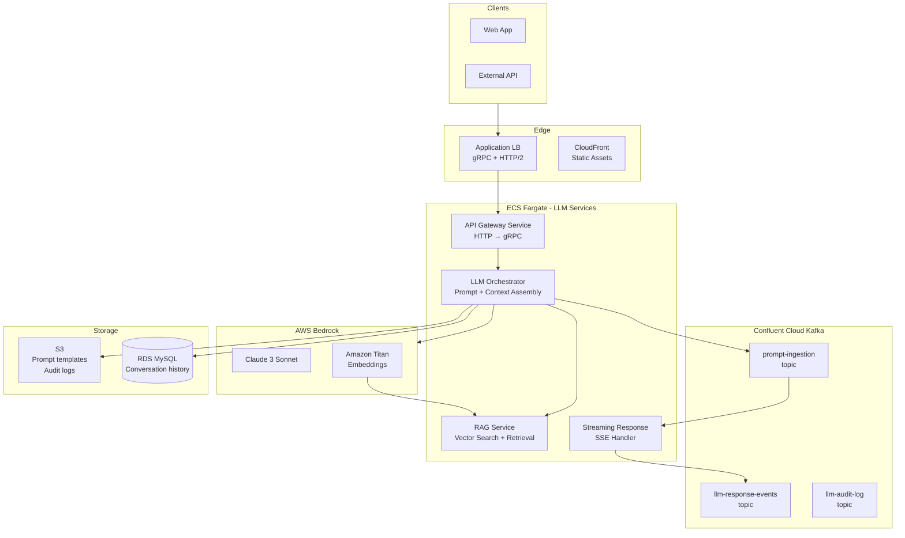

# llm-infra-on-bedrock
> Production-grade infrastructure for deploying LLM-powered microservices on AWS Bedrock, ECS Fargate, and Confluent Cloud Kafka.

   

Production-grade infrastructure for deploying LLM-powered microservices on **AWS Bedrock**, orchestrated with **ECS Fargate** and **Confluent Cloud Kafka** for async inference pipelines.

---

## Architecture



---

## Stack

| Component | Technology |
|-----------|-----------|
| Inference | AWS Bedrock (Claude 3 Sonnet, Titan Embeddings) |
| Serving | ECS Fargate + Fargate Spot |
| Async pipeline | Confluent Cloud Kafka (AWS-hosted) |
| Container registry | ECR with lifecycle policies |
| IAM | ecsTaskExecutionRole + Bedrock invoke policy |
| Service discovery | AWS Cloud Map (private DNS) |
| Observability | CloudWatch Container Insights + ECS Exec |

---

## Repository Structure

```
llm-infra-on-bedrock/
├── README.md
├── terraform/
│   ├── iam/
│   │   ├── bedrock-access.tf        # IAM group + policy for Bedrock
│   │   └── ecs-task-role.tf          # ECS task execution role
│   ├── ecs/
│   │   ├── cluster.tf               # Fargate cluster with Container Insights
│   │   ├── llm-service.tf           # LLM orchestrator ECS service
│   │   └── ecr.tf                   # ECR with lifecycle
│   ├── kafka/
│   │   ├── confluent-cluster.tf     # Confluent Cloud cluster on AWS
│   │   └── topics.tf                # LLM topics (prompt, response, audit)
│   └── networking/
│       ├── alb.tf                   # ALB with gRPC target group
│       └── service-discovery.tf     # Cloud Map DNS
├── kubernetes/
│   ├── deployment.yaml              # GKE equivalent (for hybrid deployments)
│   ├── service.yaml
│   └── hpa.yaml
└── docs/
    ├── architecture.md              # Detailed architecture + decision log
    └── bedrock-vs-sagemaker.md      # Why Bedrock over SageMaker
```

---

## Quick Start

```bash
# 1. Bootstrap IAM
cd terraform/iam
terraform init && terraform apply

# 2. Deploy ECS cluster + services
cd ../ecs
terraform init && terraform apply -var="environment=prd"

# 3. Create Confluent Kafka cluster + topics
cd ../kafka
terraform init && terraform apply

# 4. Deploy ALB
cd ../networking
terraform init && terraform apply
```

---

## Key Design Decisions

- **Bedrock over SageMaker:** Bedrock provides managed inference with no model deployment overhead. See [bedrock-vs-sagemaker.md](docs/bedrock-vs-sagemaker.md).
- **Kafka for async inference:** Long-running LLM calls (5-30s) are decoupled via Kafka so the API gateway can return a request ID immediately, with the response delivered via SSE or webhook.
- **Fargate Spot for non-streaming services:** Background processing services (audit log writers, embedding indexers) run on Spot. Streaming response services run On-Demand.

## Author

**Pranav Bansal** — AI Infrastructure & SRE Engineer

[](https://linkedin.com/in/okpranavbansal)
[](https://github.com/okpranavbansal)