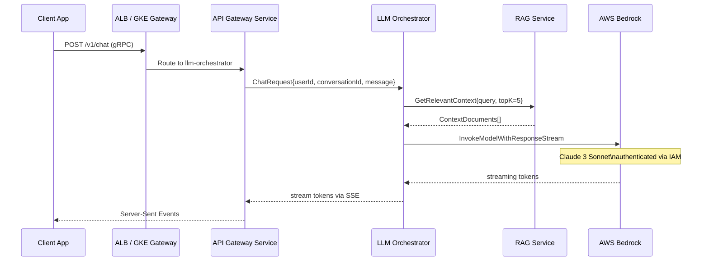
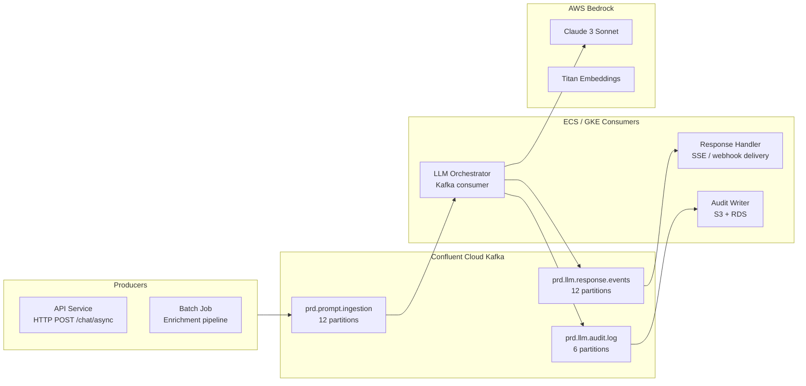

# LLM Infrastructure Architecture

## Request Flow (Synchronous)



## Async Flow (High-Volume / Batch)



## Component Sizing

| Component | ECS CPU | ECS Memory | GKE Requests | GKE Limits |
|-----------|---------|-----------|--------------|-----------|
| LLM Orchestrator | 1024m | 4096 MB | 500m / 1Gi | 2 / 4Gi |
| Embedding Service | 512m | 2048 MB | 250m / 512Mi | 1 / 2Gi |
| Response Handler | 256m | 512 MB | 100m / 256Mi | 500m / 1Gi |
| Audit Writer | 256m | 512 MB | 100m / 256Mi | 500m / 512Mi |

## Bedrock Latency Budget

```
P50:  0.8s first token (Claude 3 Sonnet streaming)
P95:  2.1s first token
P99:  4.8s first token

Complete response (1000 tokens):
P50:  3.2s
P95:  7.4s
P99:  12.1s
```

For user-facing requests: return `requestId` immediately, stream response via SSE.  
For batch/enrichment: Kafka async pattern — no latency budget applies.

## IAM Architecture

```mermaid
flowchart TD
    subgraph aws [AWS]
        TaskRole[ecsTaskExecutionRole\n+ BedrockInvokePolicy\n+ SSM read /prd/llm/*]
        Bedrock[AWS Bedrock\nClaude 3 Sonnet\nTitan Embeddings]
    end

    subgraph gke [GKE]
        KSA[copilot-sa\nKubernetes SA\nprd-copilot namespace]
        GSA[copilot-gke@prj-acme-prd\nGCP Service Account]
        K8sSecret[aws-credentials\nKubernetes Secret\nAWS_ACCESS_KEY_ID\nAWS_SECRET_ACCESS_KEY]
    end

    TaskRole --> Bedrock
    KSA -- annotated with --> GSA
    K8sSecret -- env vars --> KSA
    KSA --> Bedrock
```

**Note:** GKE → Bedrock via static AWS credentials is a temporary pattern.  
Long-term target: GKE OIDC → AWS IAM role federation (no static credentials).
